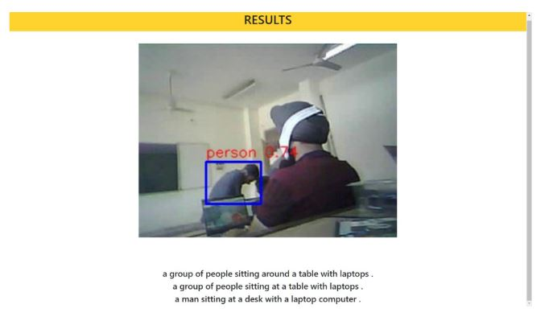

# Helix Web App

## Overview

The purpose of the project is to develop a web based app / interface which supports a smoother and user friendly graphical user interface for running the Project HELIX.
Project HELIX combines the domain of Deep Learning and Internet of Things to aid blind people in navigating their everyday environment. It generates captions describing the user's environment using a trained deep learning model, which takes input, a stream of images (over bluetooth) from ESP32 Camera along with CP2102 programmer. The deep learning model has been trained on MSCOCO dataset.

The web app is the entry point for the process of sending the stream of images from the camera to the deep learning model. The user just needs to click on the "Initiate" button to start the app, which will a run a batch file to stream images from the ESP32 camera through CP2102 progammer, and run all the models autonomously. 

The result will be a sample image among the many images that were streamed, and the generated captions themselves.

## Design

We have designed a flask server to render the landing page, which has the START button, to start the web app. The server renders the result as soon as the model results are recived which might cause some delay.

## Demo 

 
